# EntryTestGuru - High-Level Technical Architecture

## Features (MVP)

### Authentication & User Management
Comprehensive authentication system supporting anonymous users, social logins, and seamless tier transitions with Firebase Auth integration. Handles user onboarding, exam category selection, tier-based access control, and multi-device management with 3-device limit enforcement across the entire platform.

#### Tech Involved
* Firebase Auth (Google/Facebook/Phone/Email)
* Flutter device_info_plus package for device fingerprinting
* Flutter Riverpod for state management
* FastAPI user management service with device tracking
* Cloud Firestore for user profiles, preferences, and device registry
* JWT token management for API authentication with device validation
* Real-time notifications via Firebase Cloud Messaging for device management

#### Main Requirements
* Anonymous user session tracking with device-specific usage limits (no cross-device sync)
* Seamless upgrade path from anonymous → free → paid tiers
* Real-time sync of user tier limitations and usage statistics for registered users only (free/paid)
* Secure token refresh and validation across all API endpoints
* Support for multiple authentication providers with unified user experience
* 3-device limit enforcement with device fingerprinting and management for registered users only
* Interactive device management interface showing registered devices with removal capabilities (free/paid users only)
* 4th device login flow: block access, notify existing devices, require device removal before allowing new device (registered users only)
* Real-time device status updates across all active sessions for registered users
* Device metadata display with user-customizable device names, automatic device type detection, browser session tracking, last active timestamps, and registration dates (registered users only)
* Anonymous users: device-specific usage limits with no cross-device synchronization or session management

### Question Bank & Content Management System
Centralized question repository serving 10,000+ MCQs with advanced filtering, ARDE probability tagging, and comprehensive content versioning. Supports batch content updates with approval workflows and real-time question delivery optimized for mobile consumption.

#### Tech Involved
* Cloud Firestore with composite indexing for complex queries
* Firebase Storage for images and video content
* FastAPI content management service with async operations
* Redis caching layer for frequently accessed questions
* Content delivery via Firebase CDN

#### Main Requirements
* Millisecond-precision tracking of question interactions and timing data
* Complex filtering by subject, difficulty, ARDE probability, and user performance history
* Batch content creation workflow with review/approval pipeline
* Question variation support with dynamic variable substitution
* Efficient content caching strategy supporting 100K concurrent users
* Version control for questions with rollback capabilities

### Practice Mode & Learning Engine
Interactive practice system with immediate feedback, attempt tracking, and intelligent question selection based on user performance patterns. Integrates with analytics engine for precision learning insights and supports tier-based explanation access controls.

#### Tech Involved
* FastAPI practice session service with WebSocket support
* Cloud Firestore real-time listeners for live progress tracking
* Redis for session state management and attempt counting
* Flutter timer widgets with millisecond precision
* Riverpod for reactive state management of practice sessions

#### Main Requirements
* Millisecond-level timing precision for each question attempt
* Real-time enforcement of tier-based daily limits (20/50/unlimited MCQs)
* Anonymous users: device-specific limit enforcement with no cross-device synchronization
* Registered users: cross-device limit synchronization and session continuity
* Support for up to 3 attempts per question with state persistence
* Integration with explanation service for tier-based access control
* Bookmark functionality with cross-device synchronization for registered users only
* Offline capability with automatic sync on connectivity restoration for registered users

### Sprint Exams & Simulated Real Exams
Comprehensive exam simulation engine delivering timed assessments with configurable parameters and realistic exam conditions. Provides detailed performance analytics and supports both custom sprint configurations and standardized real exam replicas.

#### Tech Involved
* FastAPI exam orchestration service with precise timing controls
* Cloud Firestore for exam configuration and results storage
* WebSocket connections for real-time exam state synchronization
* Background Cloud Functions for automated grading and analytics
* Redis for exam session state management

#### Main Requirements
* Precise timer implementation with pause/resume capabilities for break intervals
* Configurable question selection algorithms based on difficulty and ARDE probability
* Real-time exam state persistence to handle connectivity interruptions
* Comprehensive scorecard generation with detailed performance breakdowns
* Integration with analytics engine for historical trend analysis
* Tier-based exam access controls (1/4/unlimited for anonymous/free/paid)

### AI-Powered Tutoring & Explanation System
Intelligent tutoring system providing contextual explanations and follow-up discussions using external LLM APIs. Implements fair usage policies with tier-based access controls and conversation context management for enhanced learning experiences.

#### Tech Involved
* FastAPI AI orchestration service with multiple LLM provider integrations
* OpenAI API, Anthropic Claude, Google Gemini API adapters
* Cloud Firestore for conversation history and context storage
* Rate limiting and quota management via Redis
* Background jobs for explanation generation and caching

#### Main Requirements
* Integration with multiple LLM providers (OpenAI, Anthropic, Gemini, Mistral)
* Tier-based explanation access control (2/4/unlimited daily explanations)
* Context-aware conversation management for follow-up questions
* Fair usage policy implementation with intelligent throttling
* Explanation caching strategy to optimize API costs and response times
* Quality filtering and content moderation for generated responses

### Analytics & Performance Tracking Engine
Comprehensive analytics platform capturing millisecond-precision user interactions, learning patterns, and performance metrics. Provides both real-time insights and historical trend analysis with specialized ARDE probability performance tracking.

#### Tech Involved
* Separate Cloud Firestore database for analytics data isolation
* BigQuery for complex analytical queries and data warehousing
* Google Analytics integration for app usage insights
* FastAPI analytics service with real-time data processing
* Background Cloud Functions for metric aggregation and computation

#### Main Requirements
* Millisecond-precision timing data capture for all user interactions
* Separate database architecture isolating learning analytics from operational data
* Real-time performance metric computation and caching
* Historical trend analysis with data retention policies
* Export functionality for external analysis tools
* ARDE probability performance correlation and strategic recommendations
* Business intelligence metrics for conversion funnel optimization

### Subscription Management & Monetization
Complete subscription lifecycle management integrated with Paddle.com for payment processing and Google AdSense for free tier monetization. Handles tier transitions, usage enforcement, and billing automation with comprehensive admin controls.

#### Tech Involved
* Paddle.com API integration for subscription management
* Google AdSense integration with Flutter ad widgets
* FastAPI subscription service with webhook handling
* Cloud Functions for automated billing and tier management
* Cloud Firestore for subscription state and usage tracking

#### Main Requirements
* Seamless integration with Paddle.com for global payment processing
* Real-time subscription status synchronization via webhooks
* Tier-based feature access enforcement across all system components
* Advertisement serving with timing exclusion from performance analytics
* Automated billing cycle management with failure handling
* Admin dashboard for subscription analytics and customer support

### Social Features & Community Platform
Community-driven learning platform with leaderboards, study groups, and competitive challenges. Supports real-time progress sharing, comparative analytics, and social accountability features to enhance user engagement and retention.

#### Tech Involved
* Cloud Firestore with real-time listeners for social data
* FastAPI social service with notification orchestration
* Firebase Cloud Messaging for push notifications
* Redis for leaderboard computation and caching
* Background jobs for challenge processing and reward distribution

#### Main Requirements
* Real-time leaderboard updates with efficient ranking algorithms
* Study group management with privacy controls and member permissions
* Comparative analytics showing individual vs. group performance metrics
* Push notification system for social engagement and milestone celebrations
* Challenge creation and participation tracking with ARDE probability themes
* Social sharing integration with external platforms

### Device Management & Account Settings
Comprehensive device management system for registered users (free/paid) allowing them to view, monitor, and control their registered devices with real-time status updates and intelligent browser consolidation. Anonymous users operate with device-specific usage limits without cross-device synchronization. Provides intuitive interface for device removal when registered users attempt to login on additional devices beyond the 3-device limit.

#### Tech Involved
* Flutter device management UI components with real-time updates and browser session displays
* Flutter web platform channels and dart:html for web machine-level identification
* Cloud Firestore device registry with real-time synchronization for cross-device management visibility
* Cloud Firestore real-time listeners for device status synchronization across browser sessions
* FastAPI device management service with CRUD operations and browser session tracking
* Firebase Cloud Messaging for cross-device notifications and consolidation alerts
* Device metadata collection and display with browser session details (Chrome, Firefox, Safari active sessions)

#### Main Requirements
* Device management interface for registered users only (free/paid) showing all registered devices with browser session breakdowns
* Anonymous users: device-specific usage tracking with local session storage only (no cross-device features)
* Automated server-side device consolidation using weighted fingerprint similarity algorithm (85% threshold) for registered users
* Interactive device removal functionality with immediate effect across all browser sessions (registered users only)
* 4th device login workflow for registered users: block access, display removal interface with browser session details, require action before proceeding
* Push notifications to existing devices when new device attempts login (registered users only)
* Device status monitoring (online/offline, last active timestamp) with per-browser session granularity for registered users
* Device nickname editing functionality for registered users allowing personalized device names (e.g., "My Work Laptop", "Home Desktop")
* Browser session tracking showing active browsers per desktop device for registered users (Chrome, Firefox, Safari, etc.)
* Anonymous users: simplified tier limit enforcement tied to current device only with no device management features
* Immediate session termination on device removal with graceful user experience across all browser sessions (registered users only)
* Device management accessible from account settings on all platforms with consolidated desktop view (registered users only)

### Content Quality Assurance & Support System
Quality management system for user-generated feedback, content corrections, and customer support workflows. Implements automated issue tracking with admin review processes and maintains content integrity across the platform.

#### Tech Involved
* FastAPI support ticket management service
* Cloud Firestore for issue tracking and resolution workflows
* Email integration for customer support communications
* Admin dashboard components for content review and user management
* Automated content flagging and quality scoring algorithms

#### Main Requirements
* In-app issue reporting system with categorization and priority handling
* Admin review workflow for content corrections and quality control
* Customer support integration with ticketing system and phone support
* Automated content quality monitoring with flagging mechanisms
* User feedback aggregation and analysis for continuous improvement

## System Diagram

```mermaid
graph TB
    %% Client Layer
    FlutterApp[Flutter Mobile App<br/>Riverpod State Management]
    WebApp[Web Application<br/>Responsive Design]
    AdminPanel[Admin Panel<br/>Content Management]

    %% API Gateway Layer
    APIGateway[FastAPI Gateway<br/>Rate Limiting & Auth]
    
    %% Microservices Layer
    AuthService[Authentication Service<br/>Firebase Auth + Device Management]
    UserService[User Management Service<br/>Profile & Device Registry]
    ContentService[Content Management Service<br/>Questions & Explanations]
    PracticeService[Practice Engine Service<br/>Session Management]
    ExamService[Exam Orchestration Service<br/>Sprint & SRE Management]
    AnalyticsService[Analytics Engine Service<br/>Performance Tracking]
    AIService[AI Tutoring Service<br/>LLM Integration]
    SocialService[Social Platform Service<br/>Groups & Leaderboards]
    SubscriptionService[Subscription Service<br/>Paddle Integration]
    NotificationService[Notification Service<br/>FCM & Email]
    DeviceService[Device Management Service<br/>Multi-Device Control]

    %% Caching Layer
    Redis[(Redis Cache<br/>Sessions & Performance)]
    
    %% Database Layer
    Firestore[(Cloud Firestore<br/>Primary Database)]
    AnalyticsDB[(Analytics Database<br/>Separate Instance)]
    BigQuery[(BigQuery<br/>Data Warehouse)]
    
    %% Storage Layer
    FirebaseStorage[(Firebase Storage<br/>Media Content)]
    CDN[Firebase CDN<br/>Global Distribution]
    
    %% External Services
    FirebaseAuth[Firebase Auth<br/>Multi-Provider]
    PaddleAPI[Paddle.com API<br/>Payments]
    OpenAI[OpenAI API<br/>GPT Models]
    Anthropic[Anthropic API<br/>Claude Models]
    Gemini[Google Gemini API<br/>AI Models]
    GoogleAnalytics[Google Analytics<br/>App Insights]
    AdSense[Google AdSense<br/>Advertisement]
    FCM[Firebase Cloud Messaging<br/>Push Notifications]
    
    %% Background Processing
    CloudFunctions[Cloud Functions<br/>Background Jobs]
    
    %% Client Connections
    FlutterApp --> APIGateway
    WebApp --> APIGateway
    AdminPanel --> APIGateway
    
    %% API Gateway Routing
    APIGateway --> AuthService
    APIGateway --> UserService
    APIGateway --> ContentService
    APIGateway --> PracticeService
    APIGateway --> ExamService
    APIGateway --> AnalyticsService
    APIGateway --> AIService
    APIGateway --> SocialService
    APIGateway --> SubscriptionService
    APIGateway --> NotificationService
    APIGateway --> DeviceService
    
    %% Service Dependencies
    AuthService --> FirebaseAuth
    AuthService --> Firestore
    UserService --> Firestore
    UserService --> Redis
    ContentService --> Firestore
    ContentService --> FirebaseStorage
    ContentService --> CDN
    PracticeService --> Firestore
    PracticeService --> Redis
    PracticeService --> AnalyticsDB
    ExamService --> Firestore
    ExamService --> Redis
    ExamService --> AnalyticsDB
    AnalyticsService --> AnalyticsDB
    AnalyticsService --> BigQuery
    AnalyticsService --> GoogleAnalytics
    AIService --> OpenAI
    AIService --> Anthropic
    AIService --> Gemini
    AIService --> Firestore
    AIService --> Redis
    SocialService --> Firestore
    SocialService --> Redis
    SocialService --> FCM
    SubscriptionService --> PaddleAPI
    SubscriptionService --> Firestore
    NotificationService --> FCM
    NotificationService --> Firestore
    DeviceService --> Firestore
    DeviceService --> FCM
    DeviceService --> Redis
    
    %% Background Processing
    CloudFunctions --> Firestore
    CloudFunctions --> AnalyticsDB
    CloudFunctions --> BigQuery
    CloudFunctions --> PaddleAPI
    
    %% Advertisement Integration
    FlutterApp --> AdSense
    WebApp --> AdSense
    
    %% Analytics Flow
    FlutterApp -.-> GoogleAnalytics
    WebApp -.-> GoogleAnalytics
    
    %% Styling
    classDef client fill:#e1f5fe
    classDef service fill:#f3e5f5
    classDef database fill:#e8f5e8
    classDef external fill:#fff3e0
    classDef cache fill:#fce4ec
    
    class FlutterApp,WebApp,AdminPanel client
    class AuthService,UserService,ContentService,PracticeService,ExamService,AnalyticsService,AIService,SocialService,SubscriptionService,NotificationService,DeviceService service
    class Firestore,AnalyticsDB,BigQuery,FirebaseStorage database
    class FirebaseAuth,PaddleAPI,OpenAI,Anthropic,Gemini,GoogleAnalytics,AdSense,FCM external
    class Redis cache
```

## Architecture Decisions & Rationale

### Microservices Architecture
- **Service Isolation**: Each major feature domain is separated into dedicated microservices to enable independent scaling, deployment, and maintenance
- **Technology Flexibility**: Allows different services to optimize for their specific requirements (e.g., AI service for LLM integration, Analytics service for data processing)
- **Team Scalability**: Multiple content creators and developers can work on different services without conflicts

### Device Management Strategy
- **Mobile Devices**: Hardware-based fingerprinting using device_info_plus package for unique, persistent device identification (registered users only)
- **Web Browsers**: Machine fingerprinting payload stored in Cloud Firestore with automated server-side consolidation logic to treat multiple browsers on same desktop as single device (registered users only)
- **Anonymous Users**: Device-specific usage limits with local session storage, no cross-device features or device registry
- **Real-time Synchronization**: All device management operations visible across all user devices via Firestore real-time listeners (registered users only)
- **Cross-Platform Consistency**: Unified device management experience across mobile apps and web browsers with instant cross-device updates for registered users
- **Security-First Approach**: Automated fingerprint matching with weighted similarity algorithm (85% threshold) prevents user manipulation of device limits for registered users
- **Simplified Anonymous Experience**: Basic tier enforcement tied to current device with no device management complexity

### Database Architecture
- **Primary Database**: Cloud Firestore for real-time capabilities, horizontal scaling, and Firebase ecosystem integration
- **Analytics Isolation**: Separate Firestore instance for analytics data to prevent performance impact on core application features
- **Data Warehousing**: BigQuery integration for complex analytical queries and long-term trend analysis
- **Caching Strategy**: Redis for session management, leaderboards, and frequently accessed data to support 100K concurrent users

### Caching & Performance Strategy
- **Multi-Layer Caching**: CDN for static content, Redis for dynamic data, and application-level caching for question banks
- **Question Bank Optimization**: Intelligent pre-loading of questions based on user patterns and ARDE probability preferences
- **Real-time Sync**: WebSocket connections for exam sessions and live leaderboards with fallback to polling

### Scalability Considerations
- **Auto-scaling**: Firebase Functions automatically scale during peak exam seasons
- **Load Distribution**: API Gateway with intelligent routing and rate limiting
- **Database Sharding**: Composite indexes in Firestore optimized for complex filtering requirements
- **Regional Optimization**: Single region deployment initially with expansion capability

### Security & Privacy
- **Authentication**: Firebase Auth with multi-provider support and JWT token validation
- **Device Management**: 3-device limit enforcement for registered users only with Flutter device fingerprinting for mobile and automated server-side similarity matching for web browsers
- **Anonymous User Limits**: Device-specific usage tracking with local session storage, no cross-device synchronization or device management features
- **Cross-Browser Consolidation**: Multiple browsers on same desktop count as single device for registered users using weighted fingerprint similarity algorithm (85% threshold)
- **Anti-Gaming Measures**: Multiple fingerprint factors (screen, platform, timezone, hardware) with weighted scoring for registered users to prevent device limit circumvention
- **API Security**: Rate limiting, request validation, and secure API key management
- **Data Privacy**: Anonymous user tracking without personal data collection, device-specific limits only
- **Payment Security**: PCI-compliant processing through Paddle.com integration

### Monitoring & Observability
- **Application Monitoring**: Firebase Crashlytics for error tracking and performance monitoring
- **Business Analytics**: Google Analytics integration for user behavior insights
- **Custom Metrics**: Real-time performance dashboards for system health and user engagement
- **Alert Systems**: Automated monitoring for API response times, error rates, and concurrent user limits